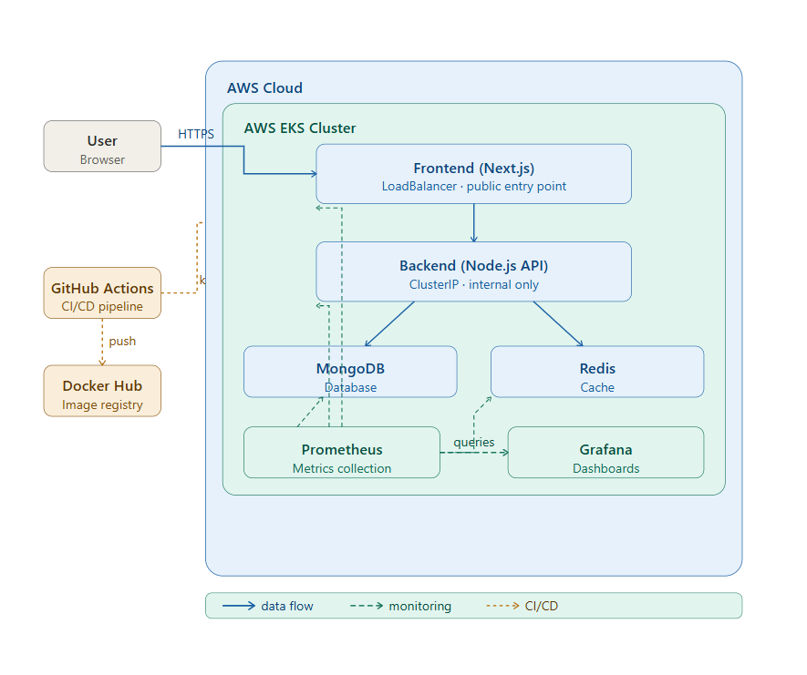
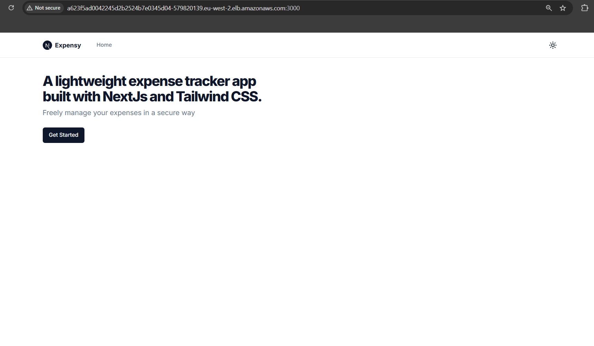
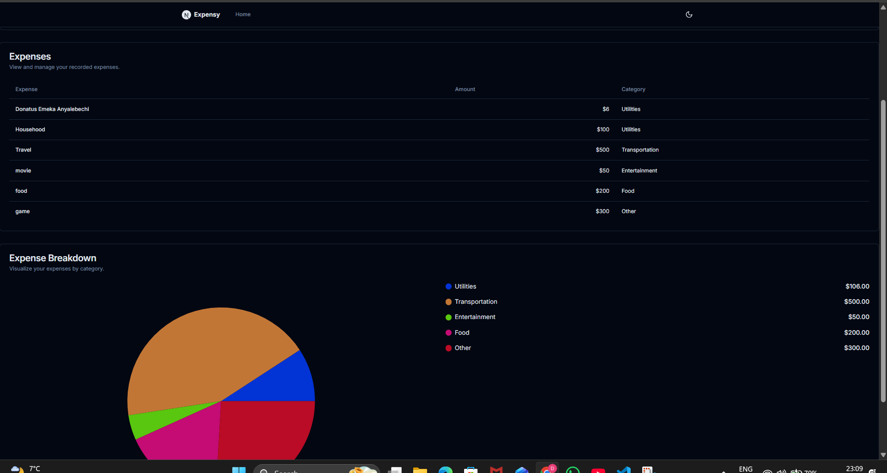
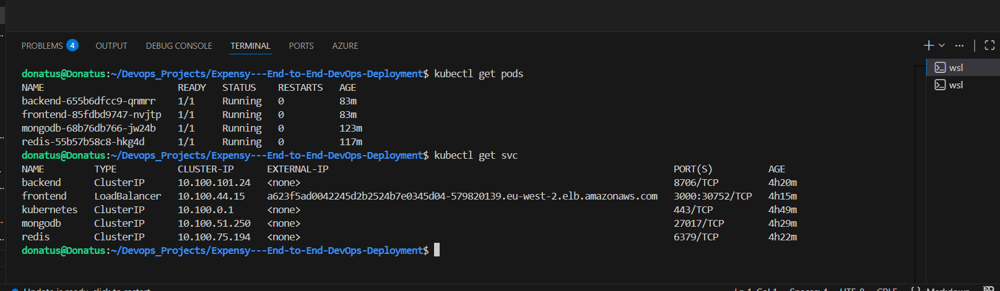
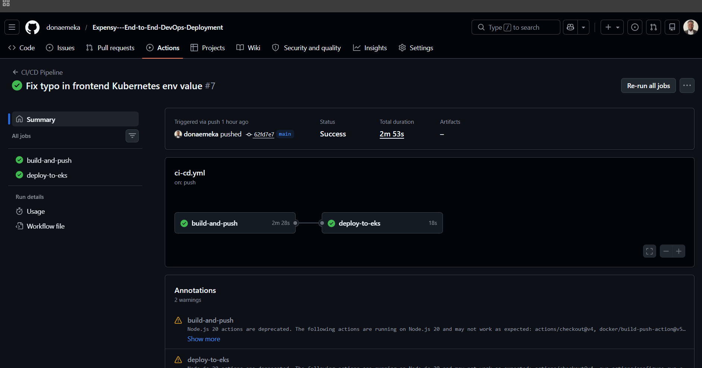
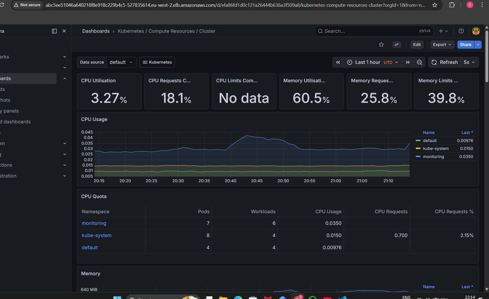

# 🚀 Expensy — End-to-End DevOps Deployment on AWS EKS

A full-stack expense tracking application deployed on **AWS EKS (Kubernetes)** using modern DevOps practices.

This project demonstrates how real-world applications are **containerized, deployed, automated, monitored, and secured** in a cloud-native environment.

---

## 📌 Project Overview

Expensy is a lightweight expense tracking system where users can manage and visualize their spending.

The application is deployed using **Kubernetes on AWS EKS**, with a complete DevOps workflow including CI/CD automation and monitoring.

This project replicates how modern applications are built and operated in production environments.

---

## 🎯 Problem It Solves

Modern applications require:

- Scalable and reliable infrastructure
- Secure handling of sensitive data
- Automated deployment pipelines
- Real-time monitoring and observability

This project demonstrates how to design and operate such a system using **DevOps best practices**.

---

## 🏗️ Architecture Overview



---

## 🔄 System Flow

User → LoadBalancer → Frontend (Next.js) → Backend (Node.js API) → MongoDB  
Backend → Redis (Caching layer)

CI/CD:  
GitHub Actions → Docker Hub → AWS EKS

Monitoring:  
Prometheus → collects metrics → Grafana → visualizes metrics

---

## 🧱 Core Components

- **Frontend**: Next.js application exposed publicly through a Kubernetes LoadBalancer service
- **Backend**: Node.js REST API exposed internally through a ClusterIP service
- **Database**: MongoDB for persistent data storage
- **Cache**: Redis for faster data access
- **Orchestration**: Kubernetes on AWS EKS
- **Monitoring**: Prometheus and Grafana
- **CI/CD**: GitHub Actions
- **Containerization**: Docker

---

## 🔧 Technology Stack

| Layer | Technology | Implementation |
|------|-----------|---------------|
| Cloud | AWS EKS, EC2, Load Balancer | Managed Kubernetes infrastructure |
| Application | Next.js + Node.js | Frontend UI and backend API |
| Containerization | Docker | Image-based deployment |
| Orchestration | Kubernetes | Deployments, Services, Secrets |
| Database | MongoDB | Persistent storage |
| Cache | Redis | Fast data access |
| Monitoring | Prometheus + Grafana | Metrics and dashboards |
| CI/CD | GitHub Actions | Automated build and deploy |
| Security | Kubernetes Secrets | Secure credentials |
| Infrastructure | YAML Manifests | Infrastructure as Code |

---

## 📊 Key Achievements

- ✅ Deployed a full-stack application on AWS EKS
- ✅ Implemented CI/CD pipeline with GitHub Actions
- ✅ Secured application using Kubernetes Secrets
- ✅ Designed a single LoadBalancer architecture
- ✅ Integrated monitoring using Prometheus and Grafana
- ✅ Enabled internal service communication using Kubernetes DNS

---

## 📊 Results

- Reduced manual deployment effort using automation
- Achieved real-time monitoring and observability
- Improved system reliability using container orchestration
- Built a production-like cloud-native infrastructure

---

## 📸 Screenshots

### 🌐 Application Preview

#### Homepage


#### Add Expense (Working App)


---

### ☸️ Kubernetes Deployment

#### Running Pods


---

### 🔁 CI/CD Pipeline

#### GitHub Actions Deployment


---

### 📊 Monitoring

#### Grafana Dashboard


---

## 🚀 Deployment Workflow

1. Build Docker images for frontend and backend
2. Push images to Docker Hub
3. GitHub Actions triggers the pipeline on push to `main`
4. Pipeline deploys the application to AWS EKS
5. Kubernetes manages the application lifecycle

---

## 🛠️ DevOps Implementation

### 1️⃣ Containerization
- Dockerized frontend and backend services
- Lightweight production images

### 2️⃣ Kubernetes Orchestration
- Deployments and Services
- ClusterIP for internal services
- LoadBalancer for public access

### 3️⃣ Networking
- Kubernetes DNS-based communication
- Single public entry point via LoadBalancer
- Internal routing for backend communication

### 4️⃣ Monitoring
- Prometheus for metrics collection
- Grafana dashboards for visualization

### 5️⃣ Security
- Kubernetes Secrets for credentials
- No hardcoded sensitive data in manifests

### 6️⃣ CI/CD
- GitHub Actions pipeline
- Automated image build and deployment to EKS

---

## 📦 Kubernetes Components

### Deployments
- frontend
- backend
- mongodb
- redis

### Services
- **LoadBalancer** → frontend
- **ClusterIP** → backend, mongodb, redis

### Secrets
- `mongo-secret`
- `redis-secret`
- `backend-secret`

---

## 📁 Project Structure

```text
Expensy---End-to-End-DevOps-Deployment/
├── expensy_backend/
├── expensy_frontend/
├── k8s/
├── docs/images/
├── .github/workflows/
├── docker-compose.yml
└── README.md
```

---

## 🐞 Troubleshooting

### Application not accessible?

```bash
kubectl get svc
kubectl get pods
```

### Pods not running?

```bash
kubectl describe pod <pod-name>
kubectl logs <pod-name>
```

### CI/CD failed?

- Check GitHub Actions logs
- Verify Docker Hub credentials
- Verify AWS credentials and permissions
- Confirm EKS cluster access

---

## 🎯 DevOps Skills Demonstrated

| Category | Tools | Evidence |
|--------|------|---------|
| Containerization | Docker | Multi-service images |
| Orchestration | Kubernetes (EKS) | Production manifests |
| Monitoring | Prometheus, Grafana | Real-time dashboards |
| CI/CD | GitHub Actions | Automated pipeline |
| Security | Kubernetes Secrets | Secure configuration |
| Cloud | AWS EKS | Managed infrastructure |
| Infrastructure as Code | YAML | Version-controlled configs |

---

## 📈 Business Value

- Faster deployments
- Improved system reliability
- Scalable cloud-native architecture
- Built-in monitoring and observability

---

## 🔮 Future Improvements

- Implement NGINX Ingress Controller
- Add HTTPS with TLS certificates
- Add Horizontal Pod Autoscaling (HPA)
- Add persistent volumes for MongoDB
- Configure alerting rules in Prometheus

---

## 👨‍💻 Author

**Donatus Emeka Anyalebechi**  
DevOps & Cloud Engineer

- 📍 Germany
- 📧 donaemeka92@gmail.com
- 🔗 [LinkedIn](https://linkedin.com/in/donatus-devops)
- 🐙 [GitHub](https://github.com/donaemeka)

---

## ⭐ Final Note

This project demonstrates a complete DevOps workflow — from development to deployment, automation, security, and monitoring — using real-world cloud-native tools.